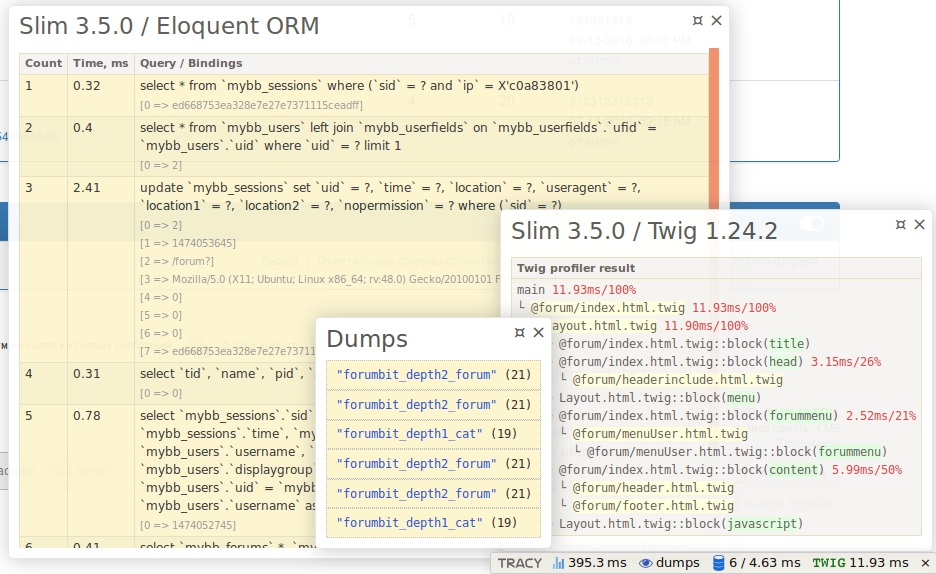

[![Latest Version on Packagist][ico-version]][link-packagist] [![Software License][ico-license]][link-license] [![Total Downloads][ico-downloads]][link-downloads]

# Slim Framework Tracy Adater #

now ready:  
PhpInfoPanel - full phpinfo(),  
SlimEnvironmentPanel - RAW data Slim Environments,  
SlimRequestPanel - RAW data Slim Request,  
SlimResponsePanel - RAW data Slim Response,  
SlimRouterPanel - RAW data Slim Router,  
EloquentORMPanel - Eloquent ORM Query / Bindings log, also can show Raw Eloquent ORM Log  
TwigPanel - Twig_Profiler_Dumper_Html(), also can show Raw Twig Profiler Dump  
VendorVersionsPanel - version info from composer.json and composer.lock (fork from https://github.com/milo/vendor-versions)  
XDebugHelper - start and stop a Xdebug session (fork from https://github.com/jsmitka/Nette-XDebug-Helper)


all configurable


# Install
**1**
``` bash
$ composer require runcmf/runtracy
```
**2** goto 3 or if need twig and/or Eloquent ORM then:

**2.1** install it
``` bash
$ composer require illuminate/database
$ composer require slim/twig-view
```

**2.2** add to your dependencies Twig, Twig_Profiler, Eloquent ORM like:
```php
// Twig
$c['twig_profile'] = function () {
    return new Twig_Profiler_Profile();
};

$c['view'] = function ($c) {
    $settings = $c->get('settings')['view'];
    $view = new \Slim\Views\Twig($settings['template_path'], $settings['twig']);
    // Add extensions
    $view->addExtension(new Slim\Views\TwigExtension($c->get('router'), $c->get('request')->getUri()));
    $view->addExtension(new Twig_Extension_Profiler($c['twig_profile']));
    $view->addExtension(new Twig_Extension_Debug());
    return $view;
};

// Register Eloquent multiple connections
$elo_con = new \Illuminate\Container\Container();
$elo_con['config'] = [
    'database.connections' => $cfg['settings']['db']['connections'],
    'database.default' => $cfg['settings']['db']['default'],
    'database.fetch' => PDO::FETCH_OBJ
];
$capsule = new \Illuminate\Database\Capsule\Manager($elo_con);
$capsule->setAsGlobal();
$capsule->bootEloquent();
$capsule::connection()->enableQueryLog();//necessary for debugging
```

**3** register Middleware
``` php
$app->add(new RunTracy\Middlewares\TracyMiddleware($app));
```

**4** add to your settings
``` php
use Tracy\Debugger;

defined('DS') || define('DS', DIRECTORY_SEPARATOR);
define('DIR', realpath(__DIR__ . '/../../') . DS);

Debugger::enable(Debugger::DEVELOPMENT, DIR . 'var/log');
//Debugger::enable(Debugger::PRODUCTION, DIR . 'var/log');
Debugger::dispatch();

return [
    'settings' => [
    ... // ...
    ... // ...

        'tracy' => [
            'showPhpInfoPanel' => 1,
            'showSlimRouterPanel' => 1,
            'showSlimEnvironmentPanel' => 1,
            'showSlimRequestPanel' => 1,
            'showSlimResponsePanel' => 1,
            'showRawSlimContainer' => 0,
            'showEloquentORMPanel' => 1,
            'showRawEloquentORMLog' => 0,
            'showTwigPanel' => 1,
            'showRawTwigProfiler' => 0,
            'showVendorVersionsPanel' => 1,
            'showXDebugHelper' => 1,
            'XDebugHelperIDEKey' => 'PHPSTORM'
        ]
```
see config examples in vendor/runcmf/runtracy/Example





## Security

If you discover any security related issues, please email to 1f7.wizard( at )gmail.com or create an issue.

## Credits

* https://bitbucket.org/1f7
* https://github.com/1f7
* http://runetcms.ru
* http://runcmf.ru

## License

[Apache License Version 2.0](LICENSE.md)

[ico-version]: https://img.shields.io/packagist/v/runcmf/runtracy.svg?style=flat-square
[ico-license]: https://img.shields.io/badge/license-Apache%202-green.svg?style=flat-square
[ico-downloads]: https://img.shields.io/packagist/dt/runcmf/runtracy.svg?style=flat-square

[link-packagist]: https://packagist.org/packages/runcmf/runtracy
[link-license]: http://www.apache.org/licenses/LICENSE-2.0
[link-downloads]: https://bitbucket.org/1f7/runtracy