[](https://travis-ci.org/runcmf/runtracy)
[](https://coveralls.io/github/runcmf/runtracy?branch=master)
[](https://codeclimate.com/github/runcmf/runtracy)
[![Latest Version on Packagist][ico-version]][link-packagist]
[![Total Downloads][ico-downloads]][link-downloads]
[![Software License][ico-license]][link-license]  
[](https://insight.sensiolabs.com/projects/2d080724-9e10-4770-9220-0678381eb341)

# Slim Framework Tracy Debugger Bar #
configure it by mouse
---
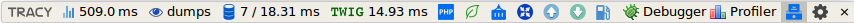

now in package:  
---
| Panel | Description |
| --- | --- |
| **Slim Framework** | - |
| Slim Environment | RAW data |
| Slim Container | RAW data |
| Slim Request | RAW data |
| Slim Response | RAW data |
| Slim Router | RAW data |
| **DB** | - |
| Doctrine [ORM](https://github.com/doctrine/doctrine2) or [DBAL](https://github.com/doctrine/dbal) | time, sql, params, types. panel & collector for both. see config example below |
| [Idiorm](https://github.com/j4mie/idiorm) | time, sql. panel & collector. **Note:** Idiorm support only one collector and if you use own this will not work. |
| [Illuminate Database](https://github.com/illuminate/database) | sql, bindings |
| **Template** | - |
| [Twig](https://github.com/twigphp/Twig) | Twig_Profiler_Dumper_Html() |
| **Common** | - |
| PanelSelector | easy configure (part of fork from [TracyDebugger](https://github.com/adrianbj/TracyDebugger)) | 
| PhpInfo | full phpinfo() |
| Console | PTY (pseudo TTY) console (fork from [web-console](https://github.com/nickola/web-console)) |
| Profiler | time, mem usage, timeline (fork from [profiler](https://github.com/netpromotion/profiler)) |
| Included Files | Included Files list |
| XDebug | start and stop a Xdebug session (fork from [Nette-XDebug-Helper](https://github.com/jsmitka/Nette-XDebug-Helper)) |
| VendorVersions | version info from composer.json and composer.lock (fork from [vendor-versions](https://github.com/milo/vendor-versions)) | 

---


# Install
**1.**
``` bash
$ composer require runcmf/runtracy
```
**2.** goto 3 or if need Twig, Doctrine DBAL, Doctrine ORM, Eloquent ORM then:

**2.1** install it
``` bash
$ composer require doctrine/dbal
$ composer require doctrine/orm
$ composer require slim/twig-view
$ composer require illuminate/database
```

**2.2** add to your dependencies (Twig, Twig_Profiler) and/or Eloquent ORM like:
```php
// Twig
$c['twig_profile'] = function () {
    return new Twig_Profiler_Profile();
};

$c['view'] = function ($c) {
    $settings = $c->get('settings')['view'];
    $view = new \Slim\Views\Twig($settings['template_path'], $settings['twig']);
    // Add extensions
    $view->addExtension(new Slim\Views\TwigExtension($c->get('router'), $c->get('request')->getUri()));
    $view->addExtension(new Twig_Extension_Profiler($c['twig_profile']));
    $view->addExtension(new Twig_Extension_Debug());
    return $view;
};

// Register Eloquent single connection
$capsule = new \Illuminate\Database\Capsule\Manager;
$capsule->addConnection($cfg['settings']['db']['connections']['mysql']);
$capsule->setAsGlobal();
$capsule->bootEloquent();
$capsule::connection()->enableQueryLog();

// Doctrine DBAL
$c['dbal'] = function () {
    $conn = \Doctrine\DBAL\DriverManager::getConnection(
        [
            'driver' => 'pdo_mysql',
            'host' => '127.0.0.1',
            'user' => 'dbuser',
            'password' => '123',
            'dbname' => 'bookshelf',
            'port' => 3306,
            'charset' => 'utf8',
        ],
        new \Doctrine\DBAL\Configuration
    );
    // possible return or DBAL\Query\QueryBuilder or DBAL\Connection
    return $conn->createQueryBuilder();
};

// Doctrine ORM
// this example from https://github.com/vhchung/slim3-skeleton-mvc
// doctrine EntityManager
$c['em'] = function ($c) {
    $settings = $c->get('settings');
    $config = \Doctrine\ORM\Tools\Setup::createAnnotationMetadataConfiguration(
        $settings['doctrine']['meta']['entity_path'],
        $settings['doctrine']['meta']['auto_generate_proxies'],
        $settings['doctrine']['meta']['proxy_dir'],
        $settings['doctrine']['meta']['cache'],
        false
    );
    // possible return or ORM\EntityManager or ORM\QueryBuilder
    return \Doctrine\ORM\EntityManager::create($settings['doctrine']['connection'], $config);
};
```  

**3.** register middleware
``` php
$app->add(new RunTracy\Middlewares\TracyMiddleware($app));
```

**4.** register route if you plan use PTY Console
``` php
$app->post('/console', 'RunTracy\Controllers\RunTracyConsole:index');
```
also copy you want `jquery.terminal.min.js` & `jquery.terminal.min.css`  from vendor/runcmf/runtracy/web and correct path in 'settings' below.  
add from local or from CDN (https://code.jquery.com/) or copy/paste
``` html
<script
    src="https://code.jquery.com/jquery-3.1.1.min.js"
    integrity="sha256-hVVnYaiADRTO2PzUGmuLJr8BLUSjGIZsDYGmIJLv2b8="
    crossorigin="anonymous"></script>
```  
  
**5.** add to your settings Debugger initialisation and 'tracy' section.   
``` php
use Tracy\Debugger;

defined('DS') || define('DS', DIRECTORY_SEPARATOR);
define('DIR', realpath(__DIR__ . '/../../') . DS);

Debugger::enable(Debugger::DEVELOPMENT, DIR . 'var/log');
//Debugger::enable(Debugger::PRODUCTION, DIR . 'var/log');

return [
    'settings' => [
        'addContentLengthHeader' => false// debugbar possible not working with true
    ... // ...
    ... // ...

        'tracy' => [
            'showPhpInfoPanel' => 0,
            'showSlimRouterPanel' => 0,
            'showSlimEnvironmentPanel' => 0,
            'showSlimRequestPanel' => 1,
            'showSlimResponsePanel' => 1,
            'showSlimContainer' => 0,
            'showEloquentORMPanel' => 0,
            'showTwigPanel' => 0,
            'showIdiormPanel' => 0,// > 0 mean you enable logging
            // but show or not panel you decide in browser in panel selector
            'showDoctrinePanel' => 'em',// here also enable logging and you must enter your Doctrine container name
            // and also as above show or not panel you decide in browser in panel selector
            'showProfilerPanel' => 0,
            'showVendorVersionsPanel' => 0,
            'showXDebugHelper' => 0,
            'showIncludedFiles' => 0,
            'showConsolePanel' => 0,
            'configs' => [
                // XDebugger IDE key
                'XDebugHelperIDEKey' => 'PHPSTORM',
                // Disable login (don't ask for credentials, be careful) values( 1 || 0 )
                'ConsoleNoLogin' => 0,
                // Multi-user credentials values( ['user1' => 'password1', 'user2' => 'password2'] )
                'ConsoleAccounts' => [
                    'dev' => '34c6fceca75e456f25e7e99531e2425c6c1de443'// = sha1('dev')
                ],
                // Password hash algorithm (password must be hashed) values('md5', 'sha256' ...)
                'ConsoleHashAlgorithm' => 'sha1',
                // Home directory (multi-user mode supported) values ( var || array )
                // '' || '/tmp' || ['user1' => '/home/user1', 'user2' => '/home/user2']
                'ConsoleHomeDirectory' => DIR,
                // terminal.js full URI
                'ConsoleTerminalJs' => '/assets/js/jquery.terminal.min.js',
                // terminal.css full URI
                'ConsoleTerminalCss' => '/assets/css/jquery.terminal.min.css',
                'ProfilerPanel' => [
                    // Memory usage 'primaryValue' set as Profiler::enable() or Profiler::enable(1)
//                    'primaryValue' =>                   'effective',    // or 'absolute'
                    'show' => [
                        'memoryUsageChart' => 1, // or false
                        'shortProfiles' => true, // or false
                        'timeLines' => true // or false
                    ]
                ]
            ]
        ]
```


see config examples in vendor/runcmf/runtracy/Example

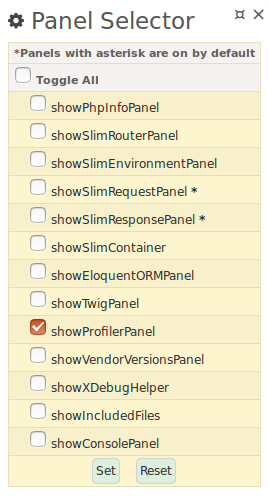

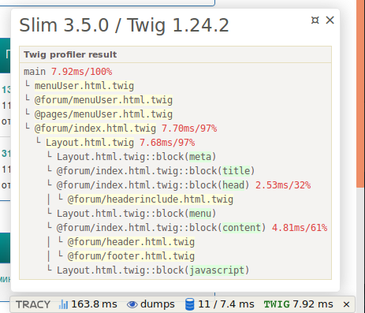

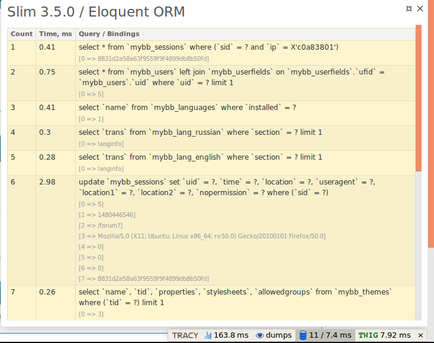

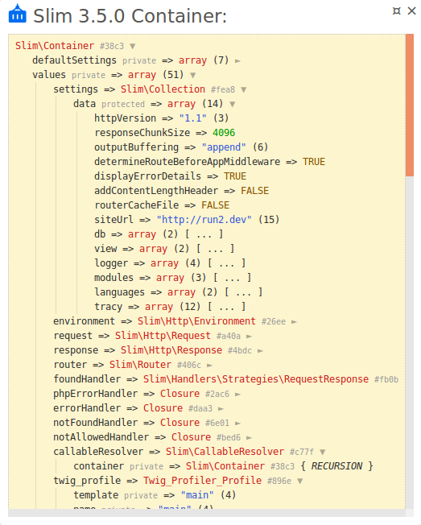

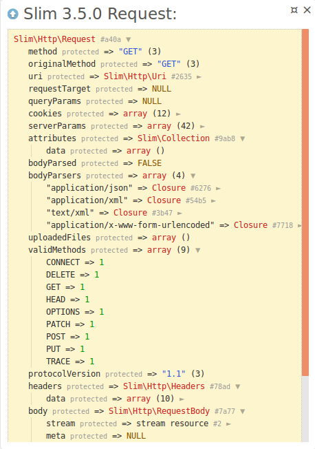

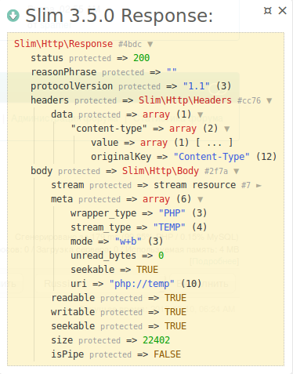

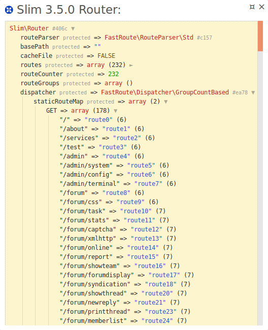

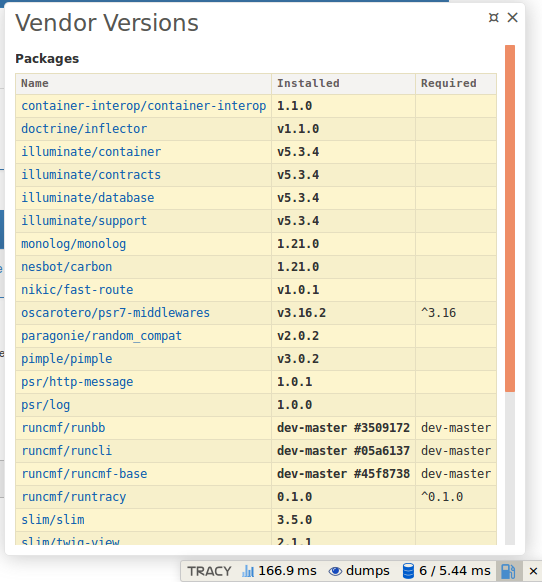

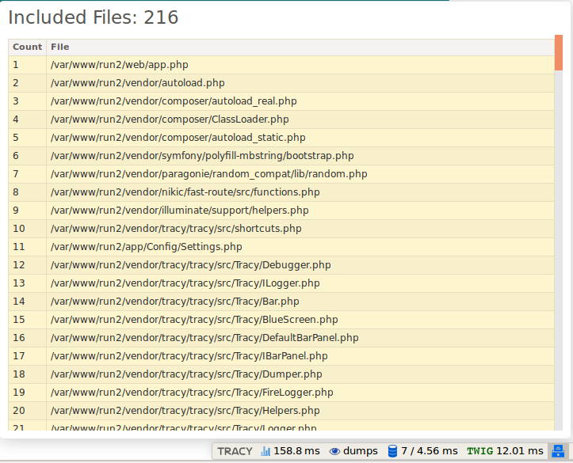

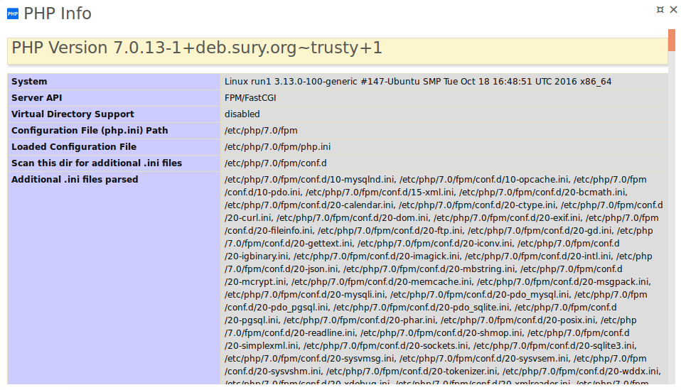

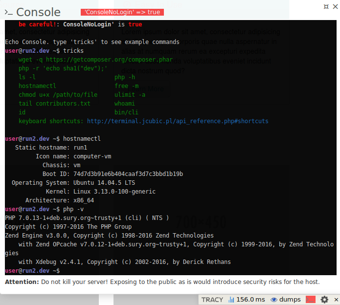


Profiler Example in new installed [slim-skeleton](https://packagist.org/packages/slim/slim-skeleton)  
 `public/index.php`
``` php
<?php
if (PHP_SAPI == 'cli-server') {
    // To help the built-in PHP dev server, check if the request was actually for
    // something which should probably be served as a static file
    $url  = parse_url($_SERVER['REQUEST_URI']);
    $file = __DIR__ . $url['path'];
    if (is_file($file)) {
        return false;
    }
}

require __DIR__ . '/../vendor/autoload.php';
RunTracy\Helpers\Profiler\Profiler::enable();
RunTracy\Helpers\Profiler\Profiler::start('App');

session_start();

    RunTracy\Helpers\Profiler\Profiler::start('initApp');
// Instantiate the app
$settings = require __DIR__ . '/../src/settings.php';
$app = new \Slim\App($settings);
    RunTracy\Helpers\Profiler\Profiler::finish('initApp');

    RunTracy\Helpers\Profiler\Profiler::start('initDeps');
// Set up dependencies
require __DIR__ . '/../src/dependencies.php';
    RunTracy\Helpers\Profiler\Profiler::finish('initDeps');

    RunTracy\Helpers\Profiler\Profiler::start('initMiddlewares');
// Register middleware
require __DIR__ . '/../src/middleware.php';
    RunTracy\Helpers\Profiler\Profiler::finish('initMiddlewares');

    RunTracy\Helpers\Profiler\Profiler::start('initRoutes');
// Register routes
require __DIR__ . '/../src/routes.php';
    RunTracy\Helpers\Profiler\Profiler::finish('initRoutes');

// Run app
$app->run();
RunTracy\Helpers\Profiler\Profiler::finish('App');
```
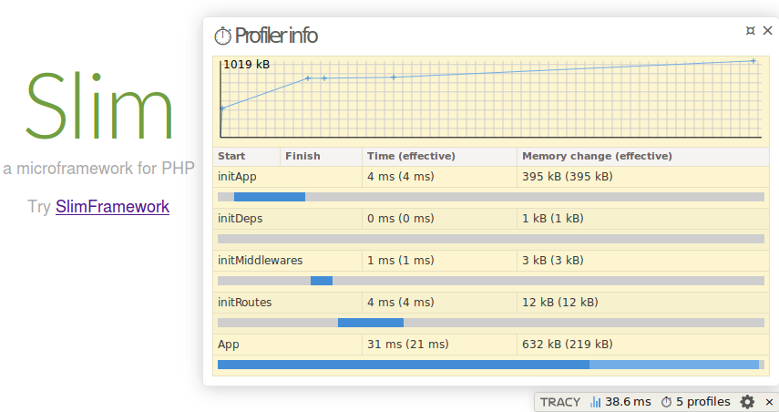

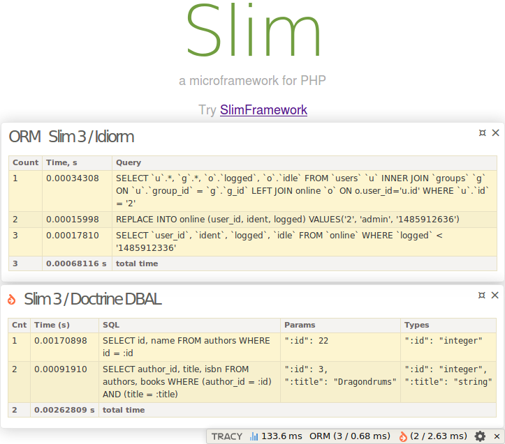

---

##  HOWTO
[how-open-files-in-ide-from-debugger](https://pla.nette.org/en/how-open-files-in-ide-from-debugger)  


---
## Tests
```bash
$ cd vendor/runcmf/runtracy
$ composer update
$ vendor/bin/phpunit
```
---  

## Security  

If you discover any security related issues, please email to 1f7.wizard( at )gmail.com instead of using the issue tracker.  

---
## Credits

* https://bitbucket.org/1f7
* https://github.com/1f7
* http://runetcms.ru
* http://runcmf.ru  

---
## License
 
```
Copyright 2016 1f7.wizard@gmail.com

Licensed under the Apache License, Version 2.0 (the "License");
you may not use this file except in compliance with the License.
You may obtain a copy of the License at

    http://www.apache.org/licenses/LICENSE-2.0

Unless required by applicable law or agreed to in writing, software
distributed under the License is distributed on an "AS IS" BASIS,
WITHOUT WARRANTIES OR CONDITIONS OF ANY KIND, either express or implied.
See the License for the specific language governing permissions and
limitations under the License.
```

[ico-version]: https://img.shields.io/packagist/v/runcmf/runtracy.svg
[ico-license]: https://img.shields.io/badge/license-Apache%202-green.svg
[ico-downloads]: https://img.shields.io/packagist/dt/runcmf/runtracy.svg

[link-packagist]: https://packagist.org/packages/runcmf/runtracy
[link-license]: http://www.apache.org/licenses/LICENSE-2.0
[link-downloads]: https://github.com/runcmf/runtracy
